<div align="center">
  
# 2026A-ISWD743-practica1
### Práctica Pentaho ETL
  
</div>

[](https://github.com/andrea-m11)<br><br>
[](https://github.com/Andreina-P)<br><br>
[](https://github.com/JoseDA0721)<br><br>
[](https://github.com/JuanMateoQ)<br><br>
[](https://github.com/juansuarezb)<br><br>

>[!NOTE]
>
> Este repositorio contiene la implementación de diversos flujos de Extracción, Transformación y Carga (ETL) utilizando Pentaho Data Integration (PDI). El objetivo principal es demostrar la capacidad de procesar datos heterogéneos (Excel, CSV, JSON, XML y SQL) para convertirlos en información estructurada y lista para el análisis.

---

>[!NOTE]
>
> Objetivos específicos:
> * Comprender el proceso ETL (Extract, Transform, Load)
> * Trabajar con múltiples fuentes de datos (Interoperabilidad)
> * Aplicar transformaciones para limpieza y procesamiento
> * Generar salidas estructuradas
> * Escalabilidad: Implementación de entornos de base de datos mediante contenedores (Docker).

---

>[!IMPORTANT]
> Stack Tecnológico
> * Pentaho Data Integration (Spoon) 10.2.0.0-222.zip - ETL Tool: <br>
>   
> * Java JDK 18.0.2.1 - Runtime <br>
> 
> * SQL Server Management Studio (SSMS) 22 - Management <br>
> 
> * Docker - DevOps <br>
> 
> * Github  DevOps <br>
> 
> * Archivos: Excel, CSV, JSON, XML, Tablas de Bases de datos SQL
> 
> 
> 


---

## Transformaciones realizadas

### 1. Excel Input → Replace in String → Excel Output

**Descripción:**
Se cargaron datos desde un archivo Excel, se realizó limpieza de texto y se exportó el resultado.

**Captura:**


---

### 2. CSV Input → String Operation (Upper) → Text Output

#### Dataset Utilizado
* **Archivo:** `babyNamesUSYOB-full.csv`
* **Campos:** `YearOfBirth`, `Name`, `Sex`, `Number`.

**Descripción:**
#### Paso 1: Extracción (Input)
Se configuró un paso de **CSV file input** para leer el archivo original. Se definió el delimitador por coma (`,`) y se obtuvieron los campos con sus respectivos tipos de datos (Integer para el año y cantidad, String para el nombre y sexo).

#### Paso 2: Transformación (String Operations)
Para normalizar la información, se utilizó el paso **String operations**. Se seleccionó la columna `Name` y se aplicó la transformación **Upper** para convertir todos los nombres de minúsculas a **MAYÚSCULAS**.

#### Paso 3: Carga (Output)
Los datos transformados se enviaron a un archivo de salida llamado `Salida.csv` mediante el paso **Text file output**. En la configuración de salida:
* Se cambió el separador a punto y coma (`;`).
* Se forzó la inclusión de los nuevos campos transformados en la pestaña *Fields*.

#### Evidencias del Proceso

##### Diseño de la Transformación en Spoon
Aquí se muestra el flujo completo desde la lectura hasta la escritura:


##### Configuración de Input


##### Configuración de la Transformación de Texto


##### Configuración Output


##### Vista Previa de los Datos (Preview)


##### Vista posterior a la transformación


#### Resultados
* **Archivo Original:** Los nombres presentaban un formato de tipo título (ej. "Mary").
* **Archivo de Salida:** Los nombres se encuentran totalmente en mayúsculas (ej. "MARY"), listos para ser procesados en un Data Warehouse.

---

### 3. JSON Input → Select Values → Output

**Descripción:**
Se procesaron datos en formato JSON, seleccionando campos relevantes para análisis.

**Captura:**


---
### 4. XML Input → Split Fields → Excel Output
---

>**Objetivo:**
- Utilizar un archivo XML como fuente de datos para aplicar la transformación **Split Fields**, permitiendo dividir un campo compuesto en dos campos independientes, y posteriormente exportar los datos procesados a un nuevo archivo Excel.
  
>**Dataset utilizado:**
- **Archivo de uso académico:** veterinaria.xml (disponible en la sección de recursos XML del repositorio de la práctica)
- **Campos:** ID, NOMBRE_MASCOTA, ESPECIE, RAZA, EDAD_AÑOS, PESO_KG, NOMBRE_PROPIETARIO, TELEFONO, FECHA_CONSULTA, DIAGNOSTICO, VETERINARIO.

>**Procedimiento:**
1. Se importaron datos desde un archivo XML, correspondientes a registros de consultas veterinarias.

    | 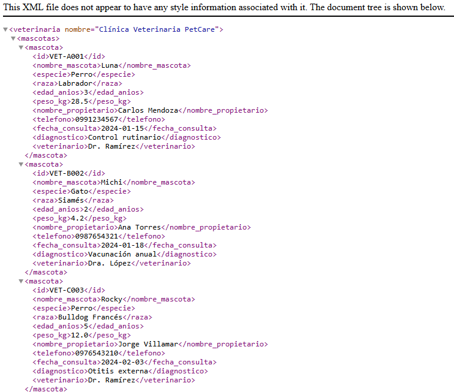|
    | :---: |
    | *Figura 1: Archivo XML de datos* |

    | 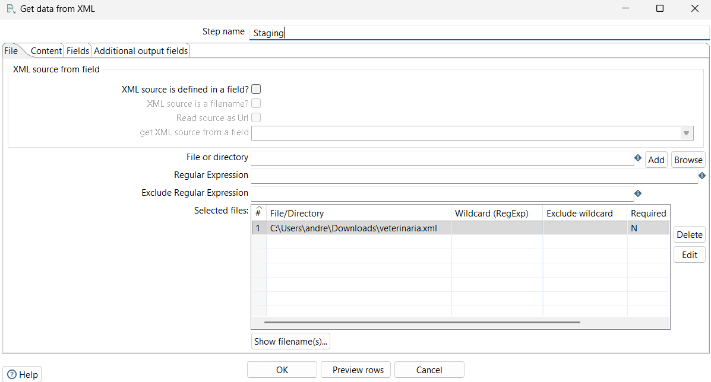|
    | :---: |
    | *Figura 2: Configuración de imput de datos XML* |

    | 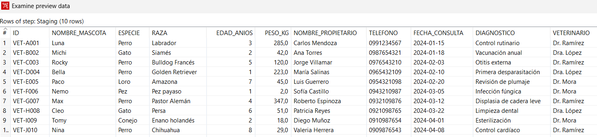|
    | :---: |
    | *Figura 3: Preview de los datos XML* |

2. Se utilizó la transformación "Split Fields" para dividir el campo que contiene el nombre completo del propietario en dos campos separados de nombre y apellido. Se utilizó el espacio ' ' como delimitador para realizar la separación.

    | 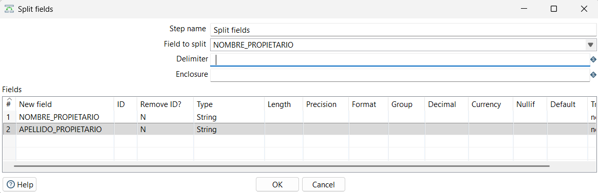|
    | :---: |
    | *Figura 4: Configuración de la transformación de datos XML Split Fields de nombre y apellido de propietario* |


3. Después, se configuró el output para exportar los datos procesados a un nuevo archivo Excel.

    | 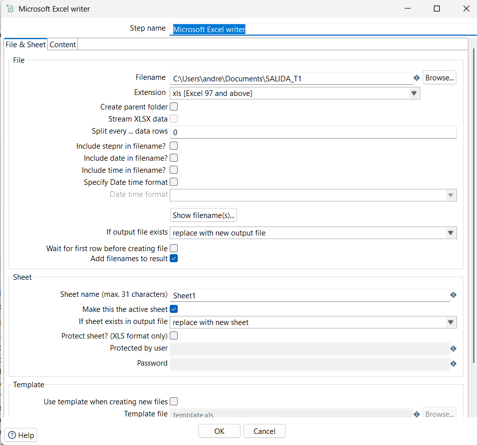|
    | :---: |
    | *Figura 5: Configuración de output a archivo Excel* |


4. Finalmente, se ejecutó la transformación para procesar los datos y generar el archivo Excel con la transformación aplicada.

    | 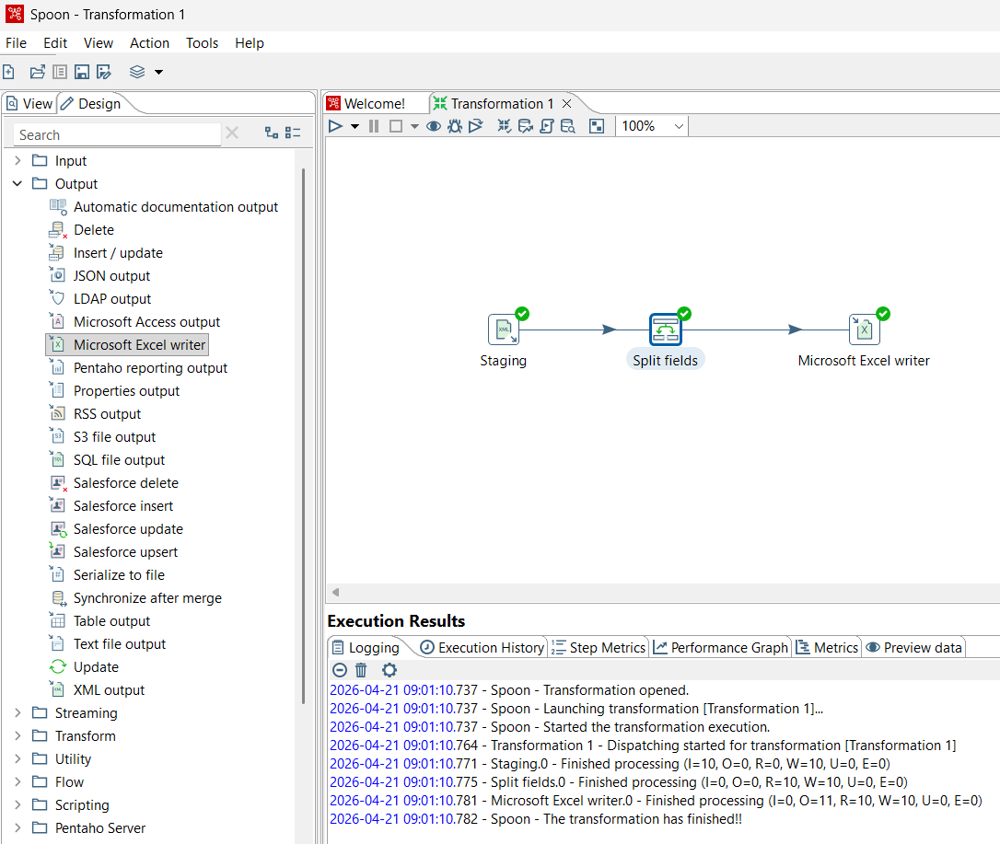|
    | :---: |
    | *Figura 6: Ejecución de la transformación* |


5. El resultado final es un archivo Excel con los datos procesados, donde se pueden observar claramente los campos separados de nombre y apellido del propietario.

    | 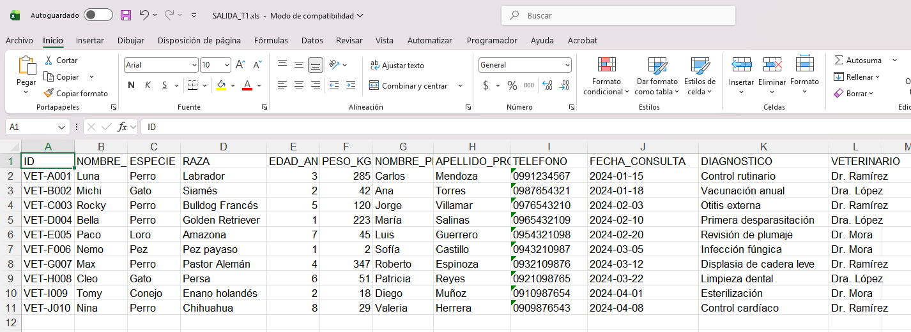|
    | :---: |
    | *Figura 7: Resultado de la transformación "Split Fields"* |

>**Comparación de datos antes y después de la transformación "Split Fields":**

| 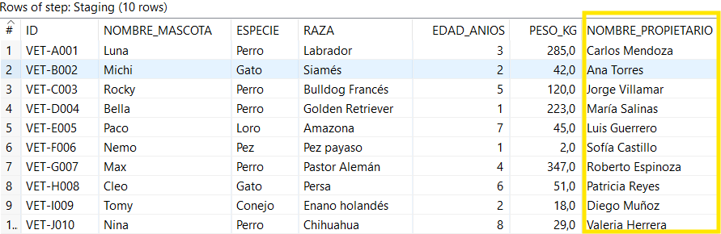 | 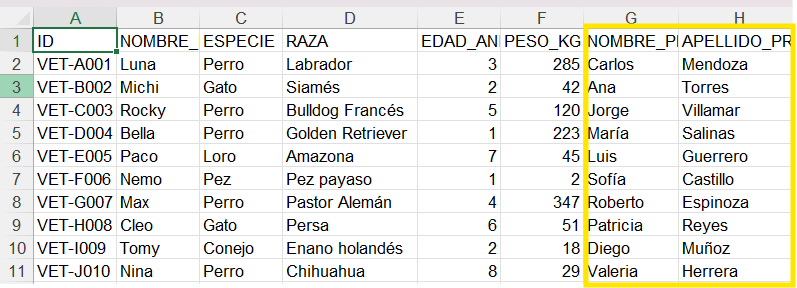 |
| :---: | :---: |
| *Figura 8: Datos antes de la transformación* | *Figura 9: Datos después de la transformación* |

**Resultado:** Como se puede observar en la comparación, el campo "NOMBRE_PROPIETARIO" que contenía el nombre completo del propietario de la mascota (ej."Ana Torres") ha sido dividido correctamente en dos campos separados: "NOMBRE" y "APELLIDO" (ej. "Ana" y "Torres"), facilitando así el análisis y manejo de los datos.

---

### 5. Table Input → Calculator → Output

**Descripción:**
Por último, se procederá a crear un entorno dockerizado para desplegar un contenedor para el SGBD (Sistema Gestor de Base de Datos) SQL Server 2025. Para ello es necesario tener instalado Docker Desktop para una mejor gestión de los contenedores. Así, se muestra a continuación la interfaz esperada al iniciar el software: 

**Captura:**
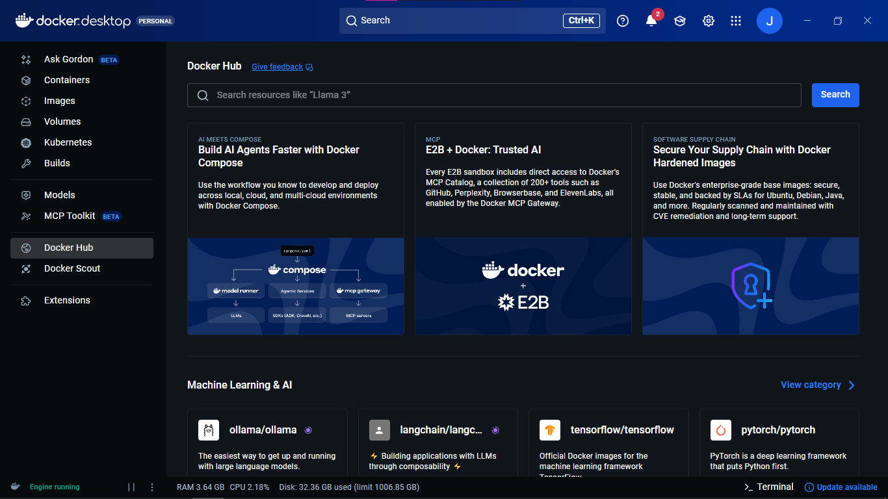

A continuación, es necesario crear un contenedor a partir de la imagen de SQL Server disponible en Docker Hub. Es necesario configurar algunas variables de entorno para el correcto funcionamiento del contenedor. 

## Levantar SQL Server con Docker

```bash
docker run -d \
  --name sqlserver2025 \
  --hostname sqlserver2025 \
  -e ACCEPT_EULA=Y \
  -e MSSQL_SA_PASSWORD=MiPassword123! \
  -e MSSQL_PID=Developer \
  -p 1433:1433 \
  -v sqlserver2025_data:/var/opt/mssql \
  mcr.microsoft.com/mssql/server:2025-latest
```

Así, tendremos levantado el contenedor de SQL Server como se muestra a continuación:

**Captura:**
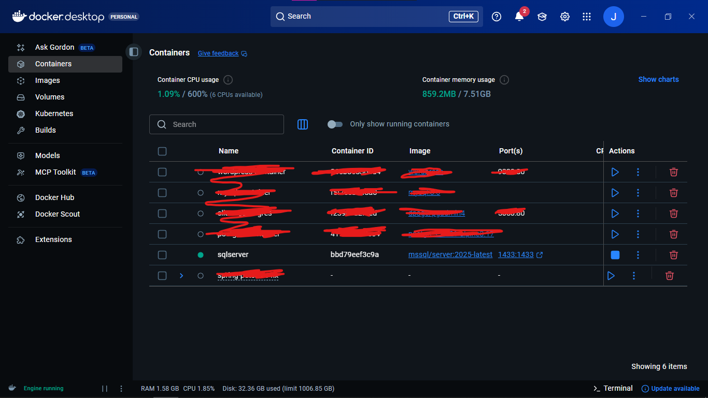
---

Este flujo conecta el entorno dockerizado con Pentaho

Lectura: Extracción de registros de la tabla Ventas en SQL Server.
Transformación: Seleccionar elementos de la tabla (columnas)
Salida: Generación de un archivo XML/JSON con los resultados finales.


Primero, es necesario crear una conexión a una base de datos para poder obtener los registros del servidor empaquetado en el contenedor. Así, seleccionamos la opción de Database connections -> New y se nos presentará una ventana para seleccionar el tipo de motor de base de datos necesario. <br>

**Captura:**
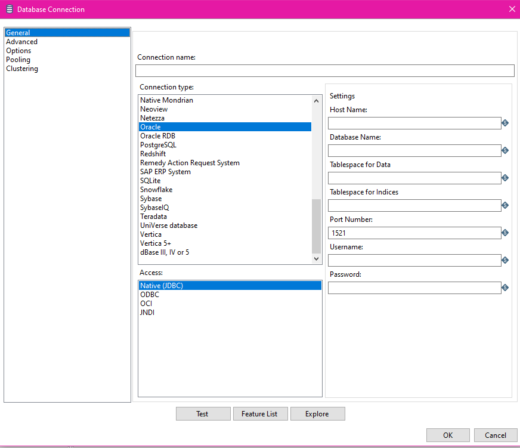 <br>

Primero, debemos de nombrar a la conexión "sql.containter" en este caso, ingresamos el host name (localhost), el nombre de la base de datos, puerto que se mapeo al momento de crear el contenedor, usuario (sa) y contraseña.

**Captura:**
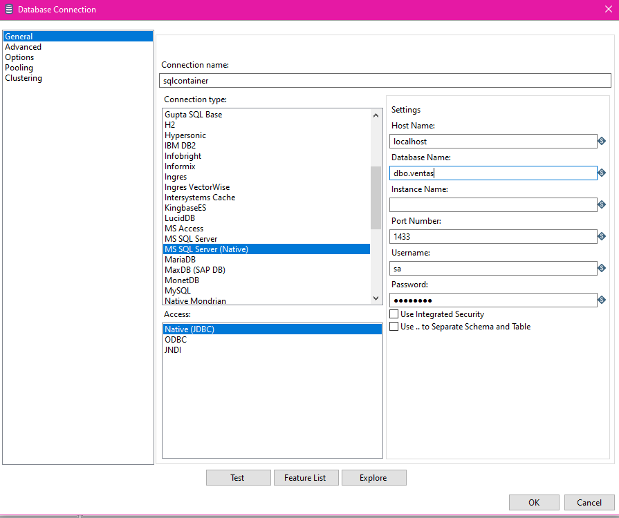 <br>

A continuación, en el menú de "Options" pasamos a configurar algúnos parámetros necesarios para el correcto funcionamiento de la conexión"

Así, procedemos a crear una nueva transformación desde el menú superior.<br>
**Captura:**
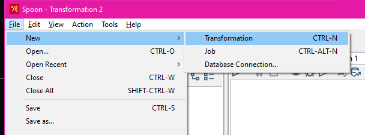 <br>

Después de ejecutar el comando para iniciar el proceso, observamos el correcto funcionamiento del flujo en los logs (Execution results) que presenta el sistema. Se observa que la transformación ha terminado correctamente y se procede a buscar el archivo en la ruta correspondiente.

**Captura:**
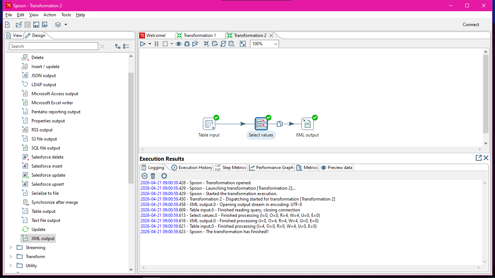

Finalmente, al encontrar el archivo resultante de la transformación, encontramos un archivo XML "salida" y al abrirlo se comprueba la correcta transformación de los datos creados en la base de datos para la tabla de ventas del contenedor hacia un archivo json con los registros.

**Captura:**
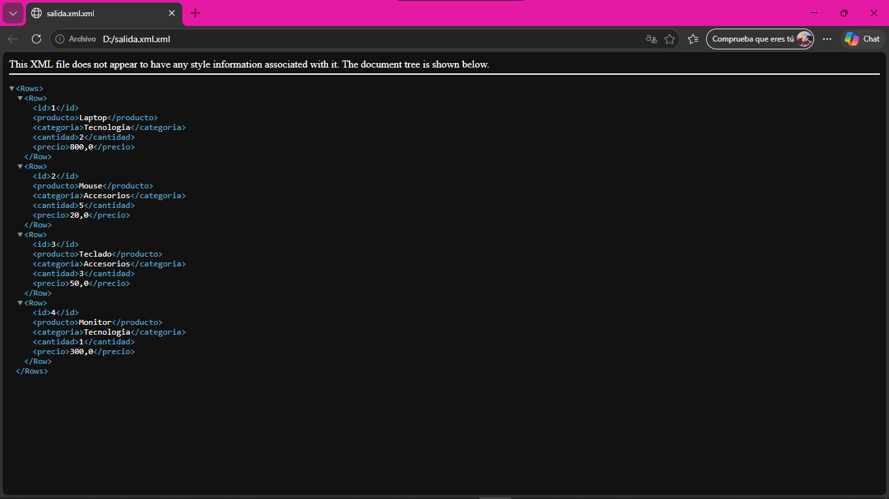 


---

## Conclusiones

El uso de Pentaho facilita la automatización de procesos ETL, permitiendo integrar y transformar datos de diversas fuentes para su posterior análisis en sistemas de Business Intelligence.

---
