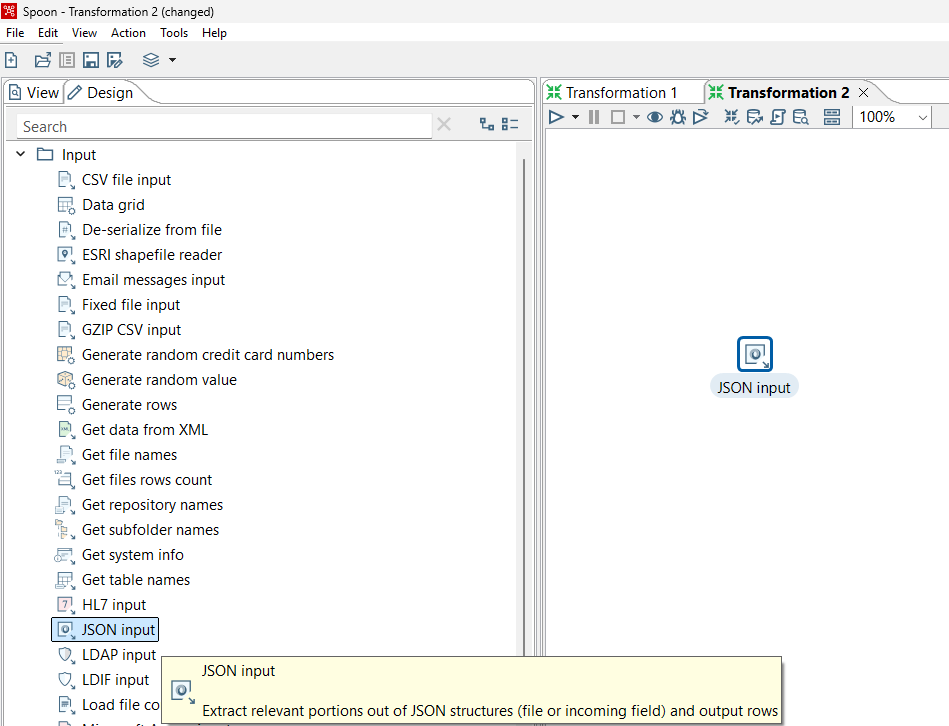
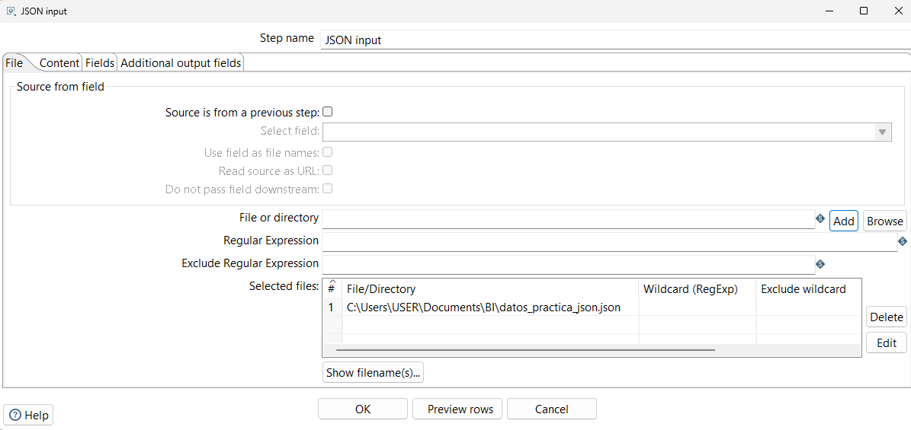
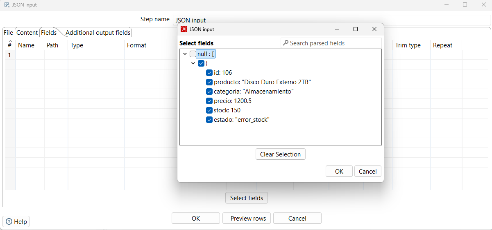
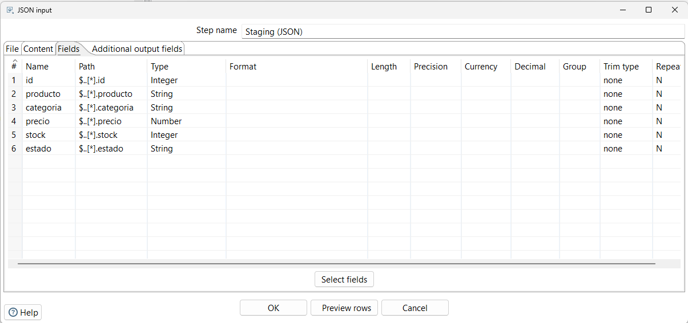
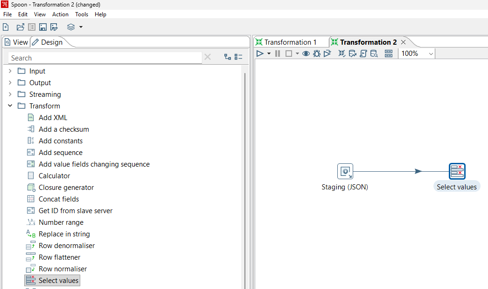
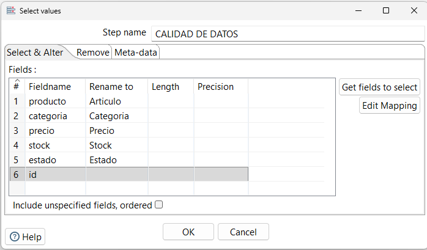
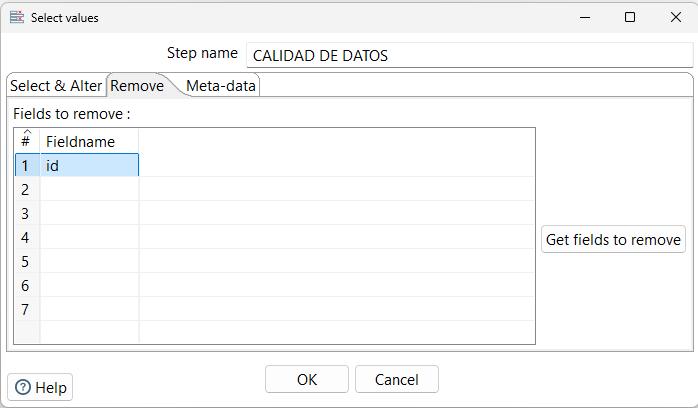
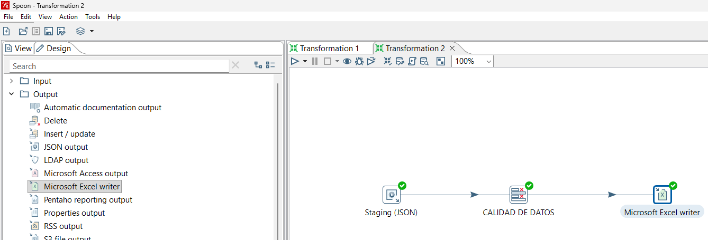
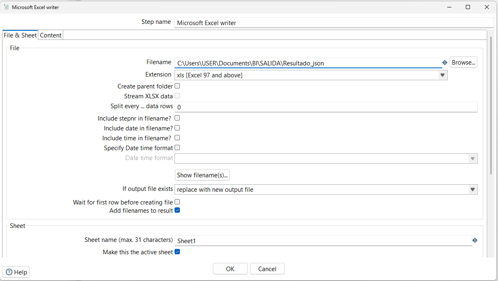
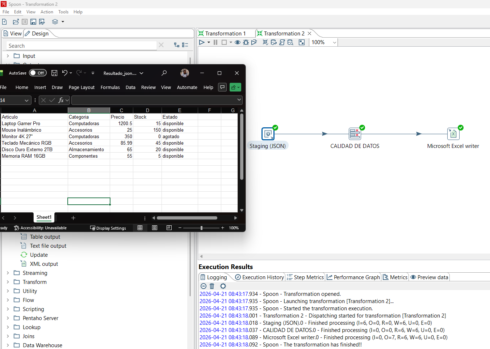

# 2026A-ISWD743-practica1
### Práctica Pentaho ETL
  
</div>

[](https://github.com/andrea-m11)<br><br>
[](https://github.com/Andreina-P)<br><br>
[](https://github.com/JoseDA0721)<br><br>
[](https://github.com/JuanMateoQ)<br><br>
[](https://github.com/juansuarezb)<br><br>

>[!NOTE]
>
> Este repositorio contiene la implementación de diversos flujos de Extracción, Transformación y Carga (ETL) utilizando Pentaho Data Integration (PDI). El objetivo principal es demostrar la capacidad de procesar datos heterogéneos (Excel, CSV, JSON, XML y SQL) para convertirlos en información estructurada y lista para el análisis.

---

>[!NOTE]
>
> Objetivos específicos:
> * Comprender el proceso ETL (Extract, Transform, Load)
> * Trabajar con múltiples fuentes de datos (Interoperabilidad)
> * Aplicar transformaciones para limpieza y procesamiento
> * Generar salidas estructuradas
> * Escalabilidad: Implementación de entornos de base de datos mediante contenedores (Docker).

---

>[!IMPORTANT]
> Stack Tecnológico
> * Pentaho Data Integration (Spoon) 10.2.0.0-222.zip - ETL Tool: <br>
>   
> * Java JDK 18.0.2.1 - Runtime <br>
> 
> * SQL Server Management Studio (SSMS) 22 - Management <br>
> 
> * Docker - DevOps <br>
> 
> * Github  DevOps <br>
> 
> * Archivos: Excel, CSV, JSON, XML, Tablas de Bases de datos SQL
> 
> 
> 


---

## Transformaciones realizadas

### 1. Excel Input → Replace in String → Excel Output

**Descripción:**
***Práctica: Carga de datos desde un archivo Excel en Pentaho***

***Paso 1: Inicialización de la herramienta***

Navegue hasta el directorio donde extrajo Pentaho Data Integration (PDI).
Localice y ejecute el archivo Spoon.bat (se recomienda ejecutarlo como administrador para evitar problemas de permisos).
Espere a que la pantalla de carga finalice y se muestre la interfaz principal de bienvenida ("Welcome Screen").

***Paso 2: Creación de una nueva Transformación***

En la barra de menú superior, diríjase a File > New > Transformation (Archivo > Nuevo > Transformación) o utilice el atajo Ctrl+N.
Se abrirá un lienzo en blanco en el panel central. Aquí es donde se construirá el flujo de integración de datos.

***Paso 3: Selección del componente de Entrada (Input)***

En el panel lateral izquierdo, asegúrese de estar en la pestaña Design (Diseño).
Despliegue la carpeta llamada Input.
Busque el paso llamado Microsoft Excel Input, haga clic sobre él y arrástrelo hacia el lienzo de la transformación.

***Paso 4: Configuración del archivo de origen***

Haga doble clic sobre el ícono de Microsoft Excel Input en el lienzo para abrir su ventana de propiedades.
En la pestaña Files:
En el campo Spread sheet type (engine), seleccione el motor adecuado para su archivo. Si es un archivo .xls antiguo, seleccione Excel 97-2003 XLS (JXL).
Haga clic en el botón Browse... y localice en su computadora el archivo a cargar (por ejemplo, Caso Estudiantes Fechas Cedula.xls).
Muy importante: Haga clic en el botón Add para que el archivo pase a la lista inferior de Selected files.

***Paso 5: Selección de la hoja de cálculo***

Sin cerrar la ventana de propiedades, cambie a la pestaña Sheets.
Haga clic en el botón Get sheetname(s).
En la ventana emergente, seleccione la hoja que contiene los datos (por ejemplo, Hoja1), pásela al cuadro de la derecha ("Your selection") y haga clic en OK.

***Paso 6: Extracción y validación de los campos (Metadata)***

Diríjase a la pestaña Fields.
Haga clic en el botón inferior Get fields from header row.... Pentaho leerá la primera fila de su archivo Excel para detectar los nombres de las columnas.
Revise la lista generada asegurándose de que columnas como ID, NOMBRES, APELLIDOS, CEDULA, etc., tengan asignado el tipo de dato correcto en la columna Type (String para textos, Number para números, Date para fechas).
Haga clic en OK para guardar toda la configuración. El paso de entrada ya está listo para enviar datos al siguiente paso de la transformación.

---

### 2. CSV Input → String Operation (Upper) → Text Output

#### Dataset Utilizado
* **Archivo:** `babyNamesUSYOB-full.csv`
* **Campos:** `YearOfBirth`, `Name`, `Sex`, `Number`.

**Descripción:**
#### Paso 1: Extracción (Input)
Se configuró un paso de **CSV file input** para leer el archivo original. Se definió el delimitador por coma (`,`) y se obtuvieron los campos con sus respectivos tipos de datos (Integer para el año y cantidad, String para el nombre y sexo).

#### Paso 2: Transformación (String Operations)
Para normalizar la información, se utilizó el paso **String operations**. Se seleccionó la columna `Name` y se aplicó la transformación **Upper** para convertir todos los nombres de minúsculas a **MAYÚSCULAS**.

#### Paso 3: Carga (Output)
Los datos transformados se enviaron a un archivo de salida llamado `Salida.csv` mediante el paso **Text file output**. En la configuración de salida:
* Se cambió el separador a punto y coma (`;`).
* Se forzó la inclusión de los nuevos campos transformados en la pestaña *Fields*.

#### Evidencias del Proceso

##### Diseño de la Transformación en Spoon
Aquí se muestra el flujo completo desde la lectura hasta la escritura:


##### Configuración de Input


##### Configuración de la Transformación de Texto


##### Configuración Output


##### Vista Previa de los Datos (Preview)


##### Vista posterior a la transformación


#### Resultados
* **Archivo Original:** Los nombres presentaban un formato de tipo título (ej. "Mary").
* **Archivo de Salida:** Los nombres se encuentran totalmente en mayúsculas (ej. "MARY"), listos para ser procesados en un Data Warehouse.

---

### 3. JSON Input → Select Values → Excel Output

>**Objetivo:**
- Utilizar un archivo JSON como fuente de datos para aplicar la transformación **Select Values**, permitiendo organizar de mejor manera el esquema final de los datos, y posteriormente exportar los datos procesados a un nuevo archivo Excel.


>**Dataset utilizado:**
* **Archivo:** `datos_practica_json.json`
* **Campos:** `id`, `producto`, `categoria`, `precio`, `stock`, `estado`.


>**Descripción:**

1. **Importación de datos:** Se importaron datos desde un archivo JSON de inventario de una tienda.
   * **1.1.** Se abre la carpeta `Input`, se busca el paso `JSON input` y se arrastra al área de trabajo para luego poder cargar el archivo `.json`.

     |  |
     | :---: |
     | *Figura 1: Selección de Input JSON* |

2. En la opción **Edit** del paso `JSON input` que se encuentra en el área de trabajo:
   * **2.1.** En la pestaña `File`, mediante el botón `Browse`, se selecciona el archivo JSON y se da clic en `Add` para que aparezca dentro de la lista `Selected files`.

     |  |
     | :---: |
     | *Figura 2: Carga del archivo de origen* |

   * **2.2.** En la pestaña `Fields`, se definen los campos mediante la selección de todos los elementos dentro de la opción `Select Fields`.

     |  |
     | :---: |
     | *Figura 3: Definición de campos JSON* |

     Luego de dar clic en **OK**, en esta pestaña se podrán visualizar todos los campos del JSON. Además, antes de guardar los cambios, se renombra el paso `JSON input` por `Staging (JSON)`.

     |  |
     | :---: |
     | *Figura 4: Campos agregados exitosamente* |

3. **Transformación de datos:** Se abre la carpeta `Transform`, se busca el paso `Select values` y se arrastra al área de trabajo para luego editar su nombre a `CALIDAD DE DATOS`.

     |  |
     | :---: |
     | *Figura 5: Agregando paso de transformación* |

   * **3.1.** En la pestaña `Select & Alter`, se da clic en `Get fields to select` y se renombran los campos según lo que se requiera, como se observa en la Figura 6.

     |  |
     | :---: |
     | *Figura 6: Renombrado de columnas para el reporte* |

   * **3.2.** En la pestaña `Remove`, se especifica el nombre del campo que se desee eliminar o, mediante `Get fields to remove`, se selecciona el campo `id`, el cual no serviría en el reporte final.

     |  |
     | :---: |
     | *Figura 7: Eliminación de campos innecesarios* |

4. **Configuración de salida:** Se abre la carpeta `Output`, se busca el paso `Microsoft Excel writer` y se arrastra al área de trabajo.

     |  |
     | :---: |
     | *Figura 8: Selección del formato de salida* |

   * **4.1.** En la pestaña `File & Sheet`, mediante `Browse` o de manera manual, se coloca la dirección del directorio y el nombre del archivo de salida deseado.

     |  |
     | :---: |
     | *Figura 9: Definición de la ruta de salida* |

5. **Ejecución del flujo:** Con el flujo estructurado de la siguiente manera: `Staging (JSON)` -> `CALIDAD DE DATOS` -> `Microsoft Excel writer`. Se da clic en el botón **Play** para ejecutar la transformación, lo cual genera el archivo Excel con la salida esperada.

     |  |
     | :---: |
     | *Figura 10: Ejecución exitosa de la transformación* |
---
### 4. XML Input → Split Fields → Excel Output
---

>**Objetivo:**
- Utilizar un archivo XML como fuente de datos para aplicar la transformación **Split Fields**, permitiendo dividir un campo compuesto en dos campos independientes, y posteriormente exportar los datos procesados a un nuevo archivo Excel.
  
>**Dataset utilizado:**
- **Archivo de uso académico:** veterinaria.xml (disponible en la sección de recursos XML del repositorio de la práctica)
- **Campos:** ID, NOMBRE_MASCOTA, ESPECIE, RAZA, EDAD_AÑOS, PESO_KG, NOMBRE_PROPIETARIO, TELEFONO, FECHA_CONSULTA, DIAGNOSTICO, VETERINARIO.

>**Procedimiento:**
1. Se importaron datos desde un archivo XML, correspondientes a registros de consultas veterinarias.

    | |
    | :---: |
    | *Figura 1: Archivo XML de datos* |

    | |
    | :---: |
    | *Figura 2: Configuración de imput de datos XML* |

    | |
    | :---: |
    | *Figura 3: Preview de los datos XML* |

2. Se utilizó la transformación "Split Fields" para dividir el campo que contiene el nombre completo del propietario en dos campos separados de nombre y apellido. Se utilizó el espacio ' ' como delimitador para realizar la separación.

    | |
    | :---: |
    | *Figura 4: Configuración de la transformación de datos XML Split Fields de nombre y apellido de propietario* |


3. Después, se configuró el output para exportar los datos procesados a un nuevo archivo Excel.

    | |
    | :---: |
    | *Figura 5: Configuración de output a archivo Excel* |


4. Finalmente, se ejecutó la transformación para procesar los datos y generar el archivo Excel con la transformación aplicada.

    | |
    | :---: |
    | *Figura 6: Ejecución de la transformación* |


5. El resultado final es un archivo Excel con los datos procesados, donde se pueden observar claramente los campos separados de nombre y apellido del propietario.

    | |
    | :---: |
    | *Figura 7: Resultado de la transformación "Split Fields"* |

>**Comparación de datos antes y después de la transformación "Split Fields":**

|  |  |
| :---: | :---: |
| *Figura 8: Datos antes de la transformación* | *Figura 9: Datos después de la transformación* |

**Resultado:** Como se puede observar en la comparación, el campo "NOMBRE_PROPIETARIO" que contenía el nombre completo del propietario de la mascota (ej."Ana Torres") ha sido dividido correctamente en dos campos separados: "NOMBRE" y "APELLIDO" (ej. "Ana" y "Torres"), facilitando así el análisis y manejo de los datos.

---

### 5. Table Input → Calculator → Output

**Descripción:**
Por último, se procederá a crear un entorno dockerizado para desplegar un contenedor para el SGBD (Sistema Gestor de Base de Datos) SQL Server 2025. Para ello es necesario tener instalado Docker Desktop para una mejor gestión de los contenedores. Así, se muestra a continuación la interfaz esperada al iniciar el software: 

**Captura:**


A continuación, es necesario crear un contenedor a partir de la imagen de SQL Server disponible en Docker Hub. Es necesario configurar algunas variables de entorno para el correcto funcionamiento del contenedor. 

## Levantar SQL Server con Docker

```bash
docker run -d \
  --name sqlserver2025 \
  --hostname sqlserver2025 \
  -e ACCEPT_EULA=Y \
  -e MSSQL_SA_PASSWORD=MiPassword123! \
  -e MSSQL_PID=Developer \
  -p 1433:1433 \
  -v sqlserver2025_data:/var/opt/mssql \
  mcr.microsoft.com/mssql/server:2025-latest
```

Así, tendremos levantado el contenedor de SQL Server como se muestra a continuación:

**Captura:**

---

Este flujo conecta el entorno dockerizado con Pentaho

Lectura: Extracción de registros de la tabla Ventas en SQL Server.
Transformación: Seleccionar elementos de la tabla (columnas)
Salida: Generación de un archivo XML/JSON con los resultados finales.


>[!WARNING]
>
> **ES NECESARIO realizar la [descarga del Microsoft JDBC Driver para SQL Server](https://learn.microsoft.com/es-es/sql/connect/jdbc/download-microsoft-jdbc-driver-for-sql-server?view=sql-server-ver17) para conectarnos al servidor de SQL**<br><br>
> Desde el sitio oficial de microsoft descargamos el archivo .zip para poder tener acceso al .jar (librería) y establecer conexión.<br>
> <br><br>
> Al descromprimir el archivo descargado debemos de copiar el archivo "mssql-jdbc-13.4.0.jre11" que se encuentra en la ruta de la imagen hacia la ruta donde se encuentran las librerias de Pentaho
> <br><br>
> data-integration\lib
> <br><br>
> A continuación, es necesario cerrar el programa y volver a ejecutar el archivo por lotes para aplicar efecto.

Primero, desde la vista "View" es necesario crear una conexión a una base de datos para poder obtener los registros del servidor empaquetado en el contenedor. Así, seleccionamos la opción de Database connections -> New y se nos presentará una ventana para seleccionar el tipo de motor de base de datos necesario.<br>
<br><br>
Luego, debemos de nombrar a la conexión "sql.containter" en este caso, ingresamos el host name (localhost), el nombre de la base de datos, puerto que se mapeo al momento de crear el contenedor, usuario (sa) y contraseña.<br>

<br><br>

>[!WARNING]
> A continuación, en el menú de "Options" pasamos a configurar algúnos parámetros necesarios para el correcto funcionamiento de la conexión". Agregamos un parámetro key:{driverClass}, value:{com.microsoft.sqlserver.jdbc.SQLServerDriver} y otro para key:{driverClass}, value:{com.microsoft.sqlserver.jdbc.SQLServerDriver}.<br>
>[parametros](CapturasSQL/11.png) <br>
> Finalmente, comprobamos la conexión al seleccionar la función "Test".<br>
>[Test](CapturasSQL/12.png) <br>

Así, procedemos a crear una nueva transformación desde el menú superior.<br>
**Captura:**
 <br>

A continuación, desde la vista "Design" vamos a cargar un Table input y al ingresar en la configuración, ingresamos la operación SQL requerida.<br>
<br>
También, podemos previsualizar los datos para comprobar la consulta.<br>
<br>
Luego, agregamos una Transformación "Select Values" para poder seleccionar los elementos obtenidos de la anterior operación.
<br>
Así mismo, al entrar en la configuración de la Transformación procedemos a seleccionar la opción "Get fields to select"
<br>
Finalmente, agregamos el output para obtener el resultado en XML.<br>
<br>

Después de ejecutar el comando para iniciar el proceso, observamos el correcto funcionamiento del flujo en los logs (Execution results) que presenta el sistema. Se observa que la transformación ha terminado correctamente y se procede a buscar el archivo en la ruta correspondiente.

**Captura:**


Finalmente, al encontrar el archivo resultante de la transformación, encontramos un archivo XML "salida" y al abrirlo se comprueba la correcta transformación de los datos creados en la base de datos para la tabla de ventas del contenedor hacia un archivo json con los registros.

**Captura:**
 


---

## Conclusiones

El uso de Pentaho facilita la automatización de procesos ETL, permitiendo integrar y transformar datos de diversas fuentes para su posterior análisis en sistemas de Business Intelligence.

---
